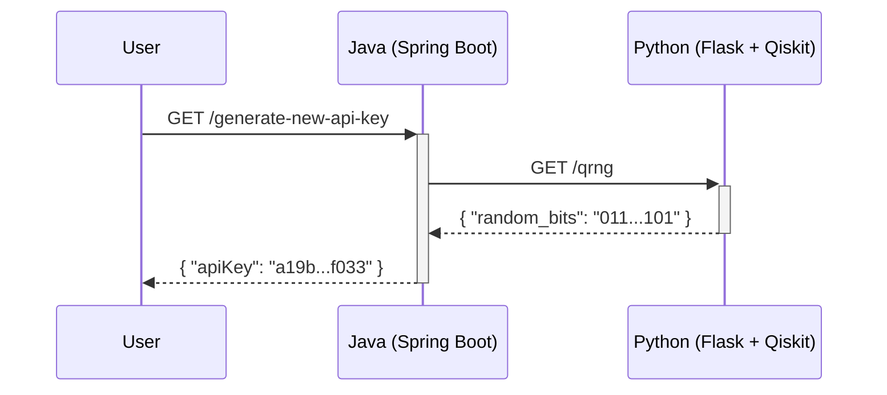

# Quantum-Secured API Key Generator


This project demonstrates a hybrid microservice architecture where a standard Java Spring Boot backend sources **truly random numbers** from a Python Qiskit service to generate secure API keys.

## Architecture & Data Flow

Instead of using a pseudo-random number generator (PRNG), the Java service calls a dedicated Python service. This service runs a quantum circuit to produce a string of bits that is random in a provable, fundamental way.

## Project Structure:
```text
QuantumSecureApi/
├── java_backend/
│   ├── pom.xml
│   └── src/
│       └── main/
│           ├── java/com/example/quantumkey/
│           │   ├── QuantumKeyApplication.java
│           │   ├── KeyGenerationController.java
│           │   ├── QuantumKeyService.java
│           │   └── dto/
│           │       └── QrngResponse.java
│           └── resources/
│               └── application.properties
│
└── python_qrng_service/
    ├── qrng_service.py
    └── requirements.txt
```
## sequence of events:


## Quick Start: How to Run

This project requires **two terminals** to run both services simultaneously.

---

### Terminal 1: Run the Python QRNG Service

1.  **Navigate to the Python service directory:**
    ```bash
    cd QuantumSecureApi/python_qrng_service
    ```

2.  **Create and activate a virtual environment:**
    ```bash
    python3 -m venv venv
    source venv/bin/activate  # On Windows: venv\Scripts\activate
    ```

3.  **Create and save a txt file named "requirements.txt " with contents:**
    ```txt
    flask
    qiskit
    qiskit-aer
    ```
5.  **Install dependencies:**
    ```bash
    pip install -r requirements.txt 
    ```

6.  **Run the Flask app:**
    ```bash
    python3 qrng_service.py
    ```
    *Service is now running on `http://127.0.0.1:5000`*

---

### Terminal 2: Run the Java Backend

1.  **Navigate to the Java service directory:**
    ```bash
    cd QuantumSecureApi/java_backend
    ```

2.  **Build and run the Spring Boot app using the Maven wrapper:**
    ```bash
    ./mvnw spring-boot:run
    ```
    *Service is now running on `http://localhost:8080`*
___ 
   ### Terminal 3: Test the Application

1.   **Open a third terminal (or use a browser or API tool like Postman).**

2.   **Use cURL to make a request to the Java backend's endpoint:**
     ```bash
     curl http://localhost:8080/generate-new-api-key
     ```

3.  **You should receive a response with your new quantum-secured key:**
    ```bash
    {"apiKey":"q_sec_a1b2c3d4e5f6...your...key..."}
    ```
